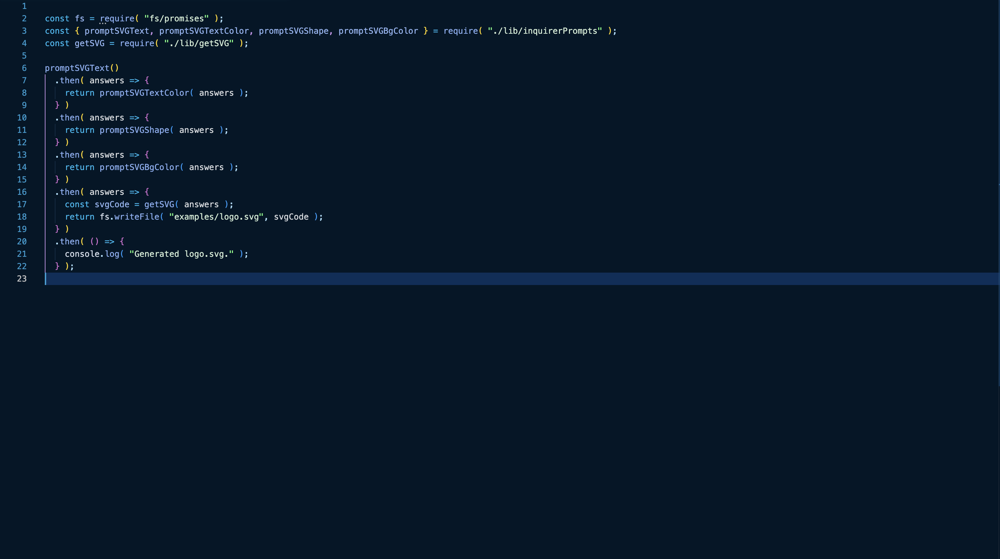
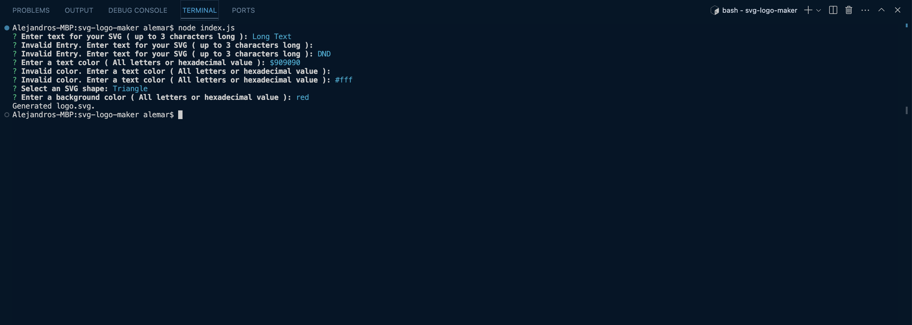

# SVG Logo Maker

## Description
This command line application will take in user input and create an SVG file
of a logo based on a selected shape: Triangle, Circle or Square.

## Built With
- Node JS
- Jest
- Inquirer

## Links
[Link to Video](https://www.loom.com/share/f2e2f7dd1edb46b2a2e73ca262bb0655?sid=ad44aca2-349a-4749-a456-e705f9422175)

## Screenshot

